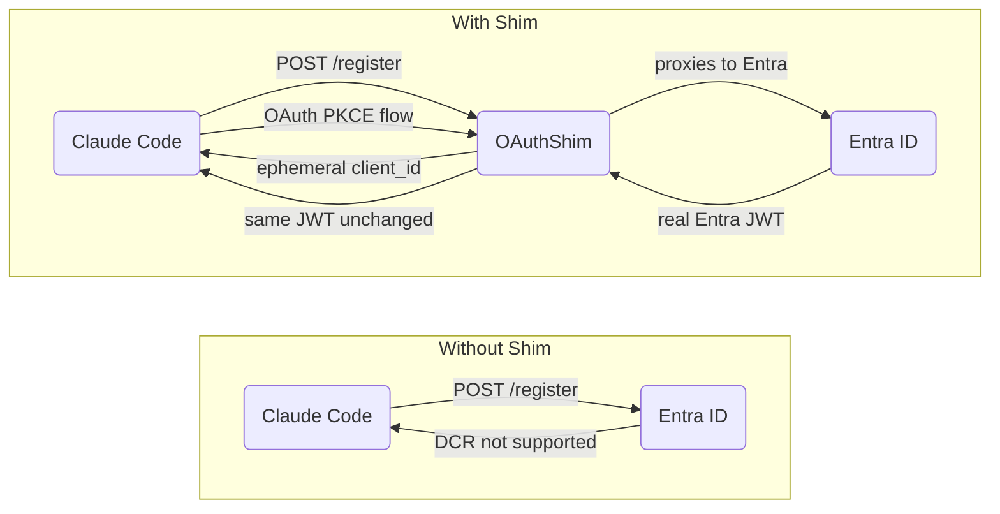
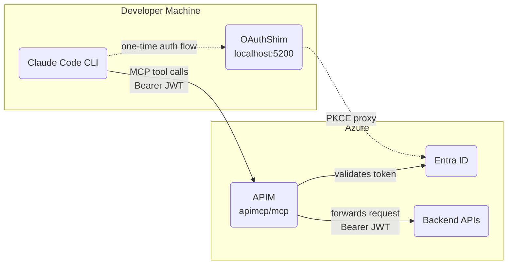
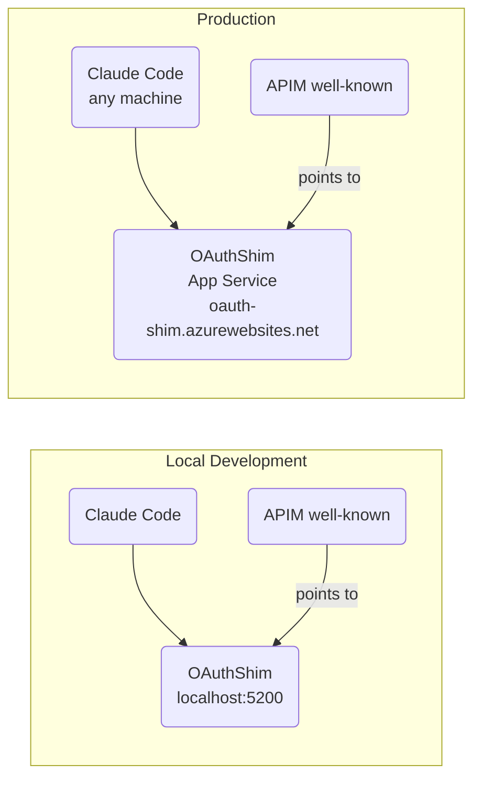
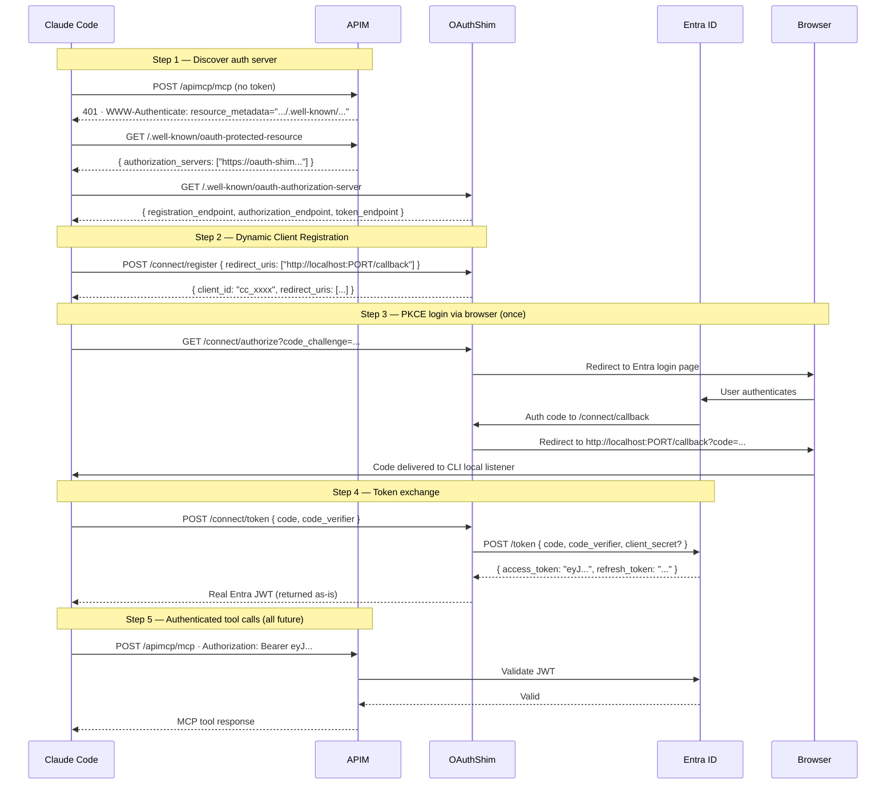
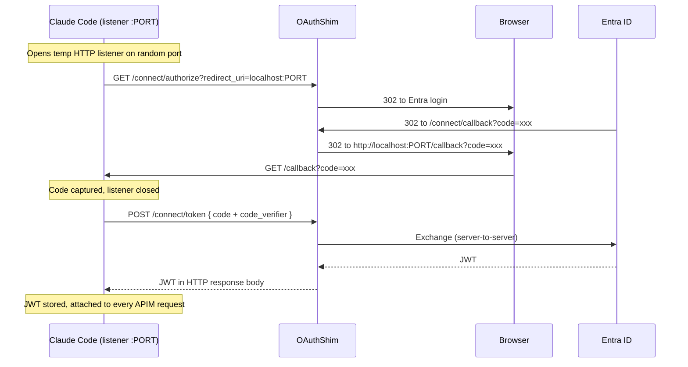
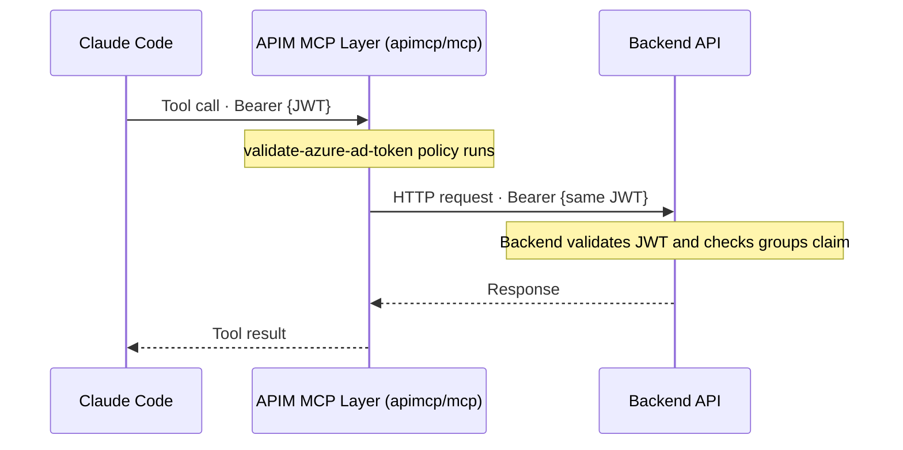

# MCP Server on Azure APIM with Entra ID Authentication

---

## Introduction

Model Context Protocol (MCP) is an open standard that allows AI models such as Claude to interact with external tools and services through a unified interface. This document describes a production-ready architecture for exposing Azure API Management (APIM) REST APIs as MCP tools for the Claude Code CLI, secured with Microsoft Entra ID.

The architecture solves a specific compatibility gap: Claude Code requires **Dynamic Client Registration (RFC 7591)** before starting an OAuth flow, but Microsoft Entra ID does not support DCR natively. The solution is a lightweight **OAuthShim** — a small proxy server that adds DCR support on top of Entra ID and transparently relays PKCE flows, delivering an unmodified Entra JWT to Claude Code.

Key properties of this architecture:

- Users authenticate once via browser; every subsequent MCP tool call carries a valid Entra JWT automatically
- APIM's native MCP server feature auto-discovers all imported APIs and exposes their operations as MCP tools — no custom MCP server code required
- The Entra JWT flows all the way to backend APIs, which can validate it independently and enforce RBAC using group claims
- The OAuthShim runs either locally (C#) or as an Azure App Service (Node.js), with no change to Claude Code configuration

---

## 1. Problem Statement — Why an OAuth Shim?

Claude Code implements the MCP 2025-03-26 specification, which requires an OAuth authorization server to support Dynamic Client Registration before starting the PKCE flow. Entra ID does not expose a `/register` endpoint.



The shim is a transparent proxy. The token Claude Code receives is an **unmodified Entra JWT** — APIM's `validate-azure-ad-token` policy works without any changes.

---

## 2. Architecture

### 2.1 Components

| Component | Technology | Role |
|---|---|---|
| **MCP Client** | Claude Code CLI | Calls MCP tools, drives the OAuth flow |
| **OAuth Shim** | C# ASP.NET Core / Node.js Express | Adds DCR support on top of Entra ID |
| **APIM MCP Server** | Azure API Management (`type: mcp`) | Auto-exposes all imported API operations as MCP tools, validates JWT |
| **Identity Provider** | Microsoft Entra ID | Issues JWT access tokens with group claims |
| **Backend APIs** | Any REST API | Receives forwarded JWT, enforces RBAC via groups claim |

### 2.2 System Overview



### 2.3 Production Deployment (App Service)

When the shim is deployed to Azure App Service, the only change is in the `BaseUrl` — Claude Code configuration and APIM policies require no modification.



| Change | Where |
|---|---|
| Deploy OAuthShim to App Service | Azure Portal |
| Add `https://<shim-url>/connect/callback` as Web redirect URI | Entra App Registration |
| Update `authorization_servers` in APIM well-known policy | APIM policy editor |
| Claude Code config | **no change needed** |

---

## 3. Authentication Flow

### 3.1 First Login (One-Time)



### 3.2 Token Delivery Detail

The authorization code travels through the browser. The actual JWT does not — it arrives via a direct `POST /connect/token` response from the shim.



### 3.3 JWT Flow to Backend



The same Entra JWT the user authenticated with reaches the backend API unchanged. The backend can read identity and group membership claims directly from it.

---

## 4. APIM Configuration

### 4.1 MCP Server

APIM's native MCP server (`type: mcp`) is configured at path `apimcp`. It automatically discovers every API imported into the APIM instance and exposes each operation as an MCP tool.

**MCP endpoint:** `https://mcp-apim-01.azure-api.net/apimcp/mcp`

### 4.2 JWT Validation Policy (apimcp API)

Applied on the `apimcp` API — all MCP tool calls must carry a valid Entra JWT.

```xml
<policies>
  <inbound>
    <validate-azure-ad-token tenant-id="{{EntraTenantId}}">
      <client-application-ids>
        <application-id>{{EntraClientId}}</application-id>
      </client-application-ids>
    </validate-azure-ad-token>
    <base />
  </inbound>
  <on-error>
    <choose>
      <when condition="@(context.LastError.Source == &quot;validate-azure-ad-token&quot;)">
        <return-response>
          <set-status code="401" reason="Unauthorized" />
          <set-header name="WWW-Authenticate" exists-action="override">
            <value>@($"Bearer realm=\"https://{{ApimGatewayUrl}}\", resource_metadata=\"https://{{ApimGatewayUrl}}/.well-known/oauth-protected-resource\"")</value>
          </set-header>
        </return-response>
      </when>
    </choose>
    <base />
  </on-error>
</policies>
```

The `on-error` block is critical — it injects the `WWW-Authenticate` header that Claude Code reads to discover which auth server to use.

### 4.3 OAuth Protected Resource Metadata (/.well-known/oauth-protected-resource)

A dedicated API with a mock policy returns the discovery document pointing to the shim.

```xml
<inbound>
  <return-response>
    <set-status code="200" reason="OK" />
    <set-header name="Content-Type" exists-action="override">
      <value>application/json</value>
    </set-header>
    <set-body>@{
      return JsonConvert.SerializeObject(new {
        resource              = "https://{{ApimGatewayUrl}}",
        authorization_servers = new[] { "https://oauth-shim.azurewebsites.net" },
        scopes_supported      = new[] { $"api://{{EntraClientId}}/access_as_user" },
        bearer_methods_supported = new[] { "header" }
      });
    }</set-body>
  </return-response>
</inbound>
```

### 4.4 Named Values

| Name | Value |
|---|---|
| `EntraTenantId` | Entra Directory (tenant) ID |
| `EntraClientId` | Entra App Registration client ID |
| `ApimGatewayUrl` | `mcp-apim-01.azure-api.net` |

---

## 5. OAuthShim Implementation

The shim implements four OAuth endpoints required by Claude Code:

| Endpoint | Method | Purpose |
|---|---|---|
| `/.well-known/oauth-authorization-server` | GET | RFC 8414 server metadata |
| `/connect/register` | POST | Dynamic Client Registration (RFC 7591) |
| `/connect/authorize` | GET | Proxy PKCE auth request to Entra, preserve original redirect_uri in state |
| `/connect/callback` | GET | Receive Entra auth code, redirect back to Claude Code's local listener |
| `/connect/token` | POST | Proxy token exchange to Entra, return real JWT unchanged |

### 5.1 C# Version (Local)

**Stack:** ASP.NET Core minimal API, .NET 8, no external packages

Runs locally alongside Claude Code. Uses `ConcurrentDictionary` for in-memory DCR client and pending auth state with a background cleanup task.

**Location:** `C:\Projects\claude Testing\OAuthShim\`

**Config (`appsettings.json`):**
```json
{
  "TenantId": "<entra-tenant-id>",
  "ClientId": "<entra-client-id>",
  "Scope":    "api://<client-id>/access_as_user",
  "BaseUrl":  "http://localhost:5200",
  "Port":     5200
}
```

**Run:** `OAuthShim.exe`

### 5.2 Node.js Version (Azure App Service)

**Stack:** Express 4, Node 18+, ES modules, no external auth libraries

Follows N-tier architecture with separate repository, service, and controller layers with dependency injection at the composition root.

```
OAuthShim-Node/
├── src/
│   ├── config/          config.js                 (reads appsettings.json + env vars)
│   ├── errors/          AppError.js               (BadRequestError, NotFoundError)
│   ├── repositories/    InMemoryClientRepository.js
│   │                    InMemoryPendingAuthRepository.js
│   ├── services/        DiscoveryService.js        (RFC 8414 metadata)
│   │                    RegistrationService.js     (DCR — issues ephemeral client IDs)
│   │                    AuthorizationService.js    (PKCE proxy, state management)
│   │                    TokenService.js            (Entra token exchange + JWT claim logging)
│   │                    CleanupService.js          (prunes stale state every 5 min)
│   ├── controllers/     DiscoveryController.js
│   │                    RegistrationController.js
│   │                    AuthorizationController.js
│   │                    CallbackController.js
│   │                    TokenController.js
│   ├── middleware/      errorHandler.js
│   ├── utils/           asyncHandler.js
│   ├── routes/          index.js
│   └── app.js           (composition root — DI wiring)
└── index.js             (server entry point, graceful shutdown)
```

**Config (App Service Application Settings):**

| Setting | Value |
|---|---|
| `CLIENT_SECRET` | Entra app client secret (required for Web-platform redirect URI) |
| `BASE_URL` | `https://oauth-shim.azurewebsites.net` (already in appsettings.json) |
| `PORT` | Set automatically by App Service |

> `CLIENT_SECRET` must be set as an App Service application setting — never in source control.

---

## 6. Entra ID App Registration

| Setting | Value |
|---|---|
| **Application (client) ID** | `e85338f8-3c5f-49b4-ac6c-38fd5754439b` |
| **Directory (tenant) ID** | `bcb8c03f-2701-4bf3-9444-7a8d71506c7d` |
| **Redirect URI — Mobile/Desktop** | `http://localhost` (for local C# shim) |
| **Redirect URI — Web** | `https://oauth-shim.azurewebsites.net/connect/callback` (for deployed Node.js shim) |
| **Allow public client flows** | Yes (for local development without client secret) |
| **Exposed scope** | `api://e85338f8.../access_as_user` |
| **Optional claims — access token** | `groups` |

> **Groups claim limit:** If a user belongs to more than 200 groups, Entra omits the `groups` claim and replaces it with a `_claim_names` / `_claim_sources` pointer to Microsoft Graph. Use App Roles for large tenants.

---

## 7. Exposing REST APIs as MCP Tools

APIM's MCP server auto-discovers all imported APIs. Each API operation becomes one MCP tool. No additional configuration is required after import.

### 7.1 Operation-to-Tool Mapping

Given an API imported at path `/orders`:

| Operation | Method | Path | MCP Tool Name |
|---|---|---|---|
| List Orders | GET | `/orders` | `listOrders` |
| Get Order | GET | `/orders/{id}` | `getOrder` |
| Create Order | POST | `/orders` | `createOrder` |
| Update Order | PUT | `/orders/{id}` | `updateOrder` |
| Delete Order | DELETE | `/orders/{id}` | `deleteOrder` |

Tool names come from `operationId` in the OpenAPI spec. Always set explicit `operationId` values.

### 7.2 OpenAPI Description Quality

Claude uses operation and parameter descriptions to decide which tool to call and what values to pass. Empty or vague descriptions produce unusable tools.

| Field | Do | Don't |
|---|---|---|
| Operation `description` | Plain English: what it does and when to use it | Leave empty or use jargon |
| `operationId` | Explicit, prefixed: `orders-listAll` | Auto-generated: `get-orders-id` |
| Parameter `description` | Include valid values and format | Use vague names like `param1` |

### 7.3 Required API Setting

Disable subscription key requirement after import — the MCP server calls APIs internally with no mechanism to supply a subscription key:

```bash
az apim api update \
  --resource-group MCP \
  --service-name mcp-apim-01 \
  --api-id <api-id> \
  --subscription-required false
```

---

## 8. Claude Code Configuration

```bash
claude mcp add --transport http apim-mcp https://mcp-apim-01.azure-api.net/apimcp/mcp
```

The `--transport http` flag selects the MCP 2025-03-26 Streamable HTTP transport, which is what APIM's native MCP server implements. The older `--transport sse` (2024-11-05 spec) is not supported.

After adding or modifying APIs in APIM, reconnect to refresh the tool list:

```bash
claude mcp remove apim-mcp
claude mcp add --transport http apim-mcp https://mcp-apim-01.azure-api.net/apimcp/mcp
```

---

## 9. Security Considerations

### 9.1 Authentication and Token Handling

- The Entra JWT is validated by APIM before any tool call is processed. Requests with missing or invalid tokens receive a `401` with a `WWW-Authenticate` header that triggers re-authentication.
- The JWT is forwarded unchanged to backend APIs. Backends should validate it independently (issuer, audience, expiry, signature) — do not trust APIM validation alone.
- The authorization code travels through the browser. The JWT itself is transmitted only via a direct server-to-server `POST /connect/token` response — it never passes through the browser.
- Refresh tokens are handled by the shim — subsequent Claude Code sessions authenticate silently without a browser prompt.

### 9.2 OAuthShim Security

- The shim validates that all `redirect_uri` values point to `http://localhost` — non-localhost redirect URIs are rejected with `400`. This prevents open-redirect attacks.
- Pending authorization state (shimState → original redirect_uri mapping) is held in memory only and pruned after 15 minutes.
- Ephemeral DCR client IDs are in-memory only and pruned after 15 minutes. The shim holds no persistent secrets on behalf of clients.
- When deployed to App Service, a `CLIENT_SECRET` is required in App Service Application Settings. It must never be committed to source control.

### 9.3 RBAC at the Backend

The `groups` claim in the Entra JWT contains the Object IDs of the user's Entra Security Groups. Backend APIs can read this claim to enforce role-based access:

- Check membership in `MCP-Readers`, `MCP-Writers`, or `MCP-Admins` groups
- Return `403` for operations the user's groups are not permitted to perform
- Log the user's `oid` and `upn` claims for audit purposes

### 9.4 Network Security

- APIM subscription key requirement should be disabled on the MCP API (JWT is the auth mechanism). Subscription keys on individual backend APIs are unaffected.
- Backend APIs should only be reachable from APIM, not directly from the internet.
- For production, deploy the OAuthShim to App Service with HTTPS only; disable HTTP.

---

## 10. Verified End-to-End Results

| Check | Result |
|---|---|
| APIM returns `401 + WWW-Authenticate` with no token | ✅ |
| Well-known returns shim as authorization server | ✅ |
| DCR accepted by shim, `redirect_uris` echoed back correctly | ✅ |
| Browser opens for Entra login | ✅ |
| Entra JWT issued — audience `api://e85338f8...` | ✅ |
| `groups` claim present in token (5 groups) | ✅ |
| APIM JWT validation passes | ✅ |
| MCP tools callable and returning responses | ✅ |
| Node.js shim deployed to App Service | ✅ |
| Token exchange with `client_secret` on App Service | ✅ |

---

## 11. Configuration Reference

### Running Locally (C# Shim)

```
1. OAuthShim\publish\OAuthShim.exe    ← keep open
2. claude                              ← start Claude Code
3. Call any MCP tool → browser opens once → done
```

Subsequent sessions use the refresh token silently — no browser prompt.

### Running Deployed (Node.js on App Service)

```
1. App Service runs OAuthShim-Node automatically
2. claude                              ← start Claude Code
3. Call any MCP tool → browser opens once → done
```

### Key Values

| Variable | Where to find |
|---|---|
| Entra Tenant ID | Entra ID → Overview → Directory (tenant) ID |
| Entra Client ID | App registration → Overview → Application (client) ID |
| Entra Client Secret | App registration → Certificates & secrets → create new |
| APIM Gateway URL | APIM instance → Overview → Gateway URL |
| MCP Endpoint | `https://<apim-name>.azure-api.net/apimcp/mcp` |
| OAuthShim (local) | `http://localhost:5200` |
| OAuthShim (deployed) | `https://oauth-shim.azurewebsites.net` |

---

## 12. Comparison: Local Shim vs Deployed Shim

| Aspect | C# Local Shim | Node.js App Service Shim |
|---|---|---|
| **Runtime** | Developer machine only | Azure App Service — accessible from any machine |
| **Auth method** | Public client (no secret needed) | Confidential client (`client_secret` required) |
| **Redirect URI platform** | Mobile/Desktop (`http://localhost`) | Web (`https://oauth-shim.azurewebsites.net/...`) |
| **Suitable for** | Individual developer R&D | Team-wide or CI/CD use |
| **Token caching** | In-memory, lost on restart | In-memory, lost on restart (stateless) |
| **Operational overhead** | Must run OAuthShim.exe manually | Always-on, managed by Azure |
| **Secret management** | None needed | `CLIENT_SECRET` in App Service config |
| **Architecture** | Single-file minimal API | N-tier: controller / service / repository layers |

---

*Project files: `C:\Projects\claude Testing\OAuthShim\` (C#) · `C:\Projects\claude Testing\OAuthShim-Node\` (Node.js)*
